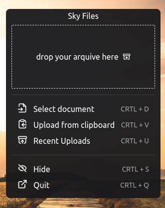
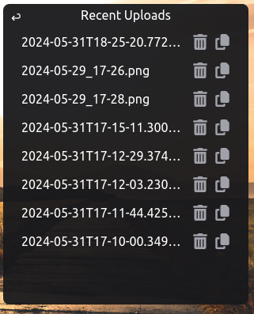

### Sky Files README

---

#### Índice

1. Introdução
2. Funcionalidades
3. Instalação
4. Uso
5. Capturas de Tela
6. Contribuição
7. Licença

---

### Introdução

Sky Files é um aplicativo desktop projetado para facilitar o upload de arquivos para a nuvem usando o Supabase. Os usuários podem facilmente fazer upload de arquivos do seu sistema local ou diretamente da área de transferência e receber um link para acessar esses arquivos de qualquer lugar.

---

### Funcionalidades

- Arrastar e Soltar: Faça upload de arquivos facilmente arrastando e soltando-os no aplicativo.
- Upload da Área de Transferência: Faça upload de imagens diretamente da sua área de transferência.
- Uploads Recentes: Visualize e gerencie seus arquivos carregados recentemente.
- Teclas de Atalho: Use atalhos de teclado para ações mais rápidas.
  Gerenciamento de Arquivos: Exclua ou copie links para seus arquivos carregados.

---

### Instalação

1. Clone o Repositório:

```cmd
git clone https://github.com/seuusuario/sky-files.git
cd sky-files
```

2. Instale as Dependências:

```
yarn install
```

3. Configure o Supabase:
   adicione os dados das suas credenciais do Supabase no arquivo .env:

```
VITE_RENDERER_URL_SUPABASE=*************
VITE_RENDERER_KEY_SUPABASE=*************

```

4. Inicie o Aplicativo:

```
yarn start
```

5. para buildar use um dos comandos:

```bash
# Para windows
yarn build:win

# Para macOS
yarn build:mac

# Para Linux
yarn build:linux
```

### Uso

- Arrastar e Soltar: Abra o aplicativo e arraste os arquivos para a área de upload para enviar.
- Upload da Área de Transferência: Use a opção "Upload from clipboard" ou pressione CTRL + V para fazer upload de uma imagem da sua área de transferência.
- Visualizar Uploads Recentes: Clique no botão "Recent Uploads" ou pressione CTRL + U para ver a lista de arquivos carregados recentemente.
- Gerenciar Arquivos: Na seção "Recent Uploads", você pode excluir arquivos ou copiar seus links para compartilhamento.

### Capturas de Tela

##### Interface Principal



##### Uploads Recentes



### Contribuição

Contribuições da comunidade são bem-vindas. Siga estes passos para contribuir:

1. Faça um fork do repositório.
2. Crie uma nova branch (git checkout -b feature-branch).
   Faça suas alterações.
3. Commit suas alterações (git commit -m 'Adicionar uma funcionalidade').
4. Push para a branch (git push origin feature-branch).
   Abra um Pull Request.
